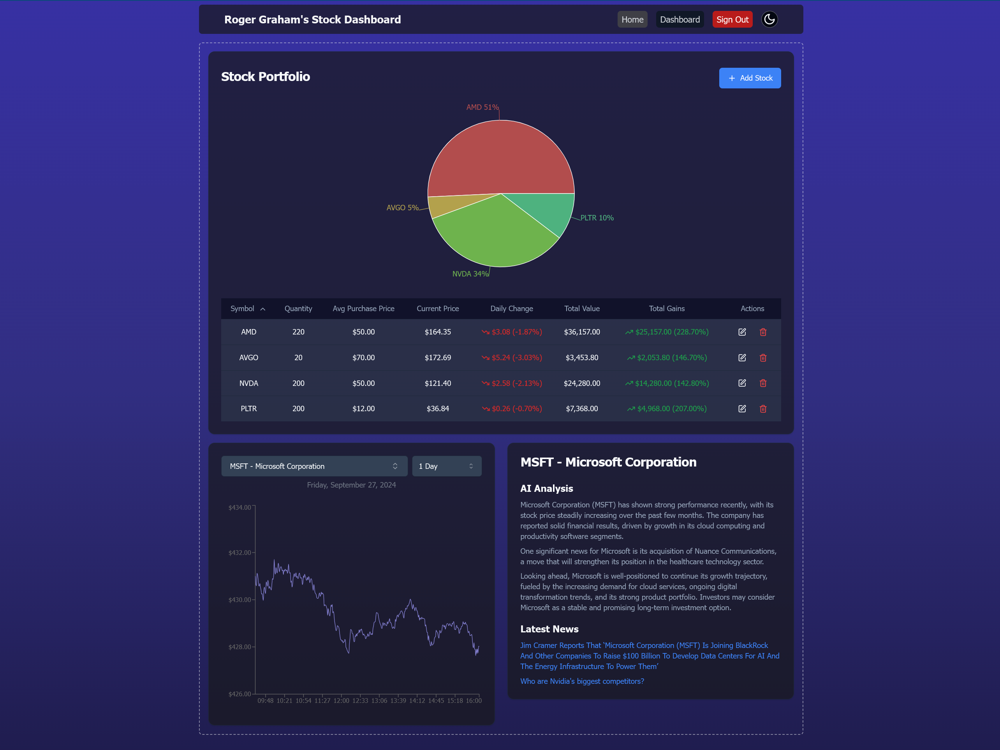

# Stock Market Dashboard

 

Stock Market Dashboard is a web application that allows users to track and manage their stock portfolio. This README provides an overview of the app's features and functionality.

Check out the live app here: [Stock Market Dashboard Live](https://stock-dashboard-olive.vercel.app/dashboard)

## Features
- **Stock Portfolio Tracking:** View and manage your stock portfolio in real-time.
- **Stock Dashboard:** Visualise your portfolio positions.  
- **Real-time Market Data:** Get the latest market data and news to inform your investment decisions.
- **Theme Switching:** Switch between light and dark modes to suit your viewing preferences.
- **Responsive Design:** A user-friendly interface that works seamlessly across desktop and mobile devices.

## How It Works
1. Log in to the app using your GitHub account.
2. Add stocks to your portfolio by searching for ticker symbols.
3. View real-time market data and visualisations for your stock portfolio.
4. Switch between light and dark modes using the theme toggle button.

## Technology Stack
- **Next.js 14 (React)** for the frontend, backend, and API routes
- **Tailwind CSS** for styling
- **Prisma** for database management
- **PostgeSQL** database provider
- **Next-Auth** for authentication
- **Shadcn** ui component library
- **YahooFinance** Finance API
- **Finnhub** Finance API
- **OpenAI** API
- **NewsApi** News feed API 

## Env variables
* DATABASE_URL=
* FINNHUB_API_KEY=
* NEXTAUTH_URL=
* NEXTAUTH_SECRET=
* OPENAI_API_KEY=
* GITHUB_ID=
* GITHUB_SECRET=
* GOOGLE_ID=
* GOOGLE_SECRET=
* DEFAULT_STOCK=S&P500
* NEWS_API_KEY=
* POSTGRES_PRISMA_URL=

